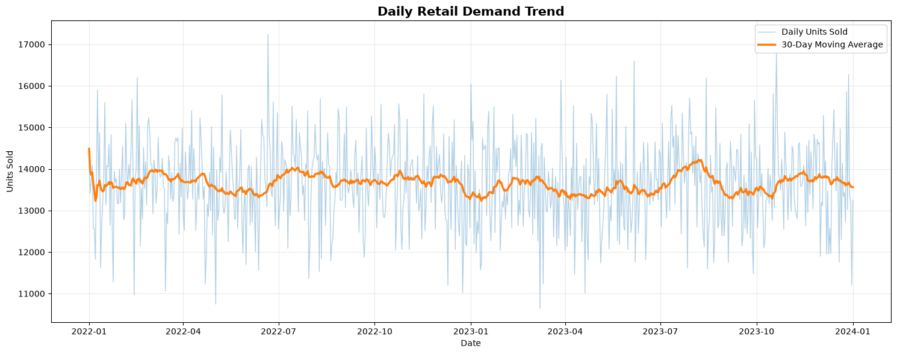
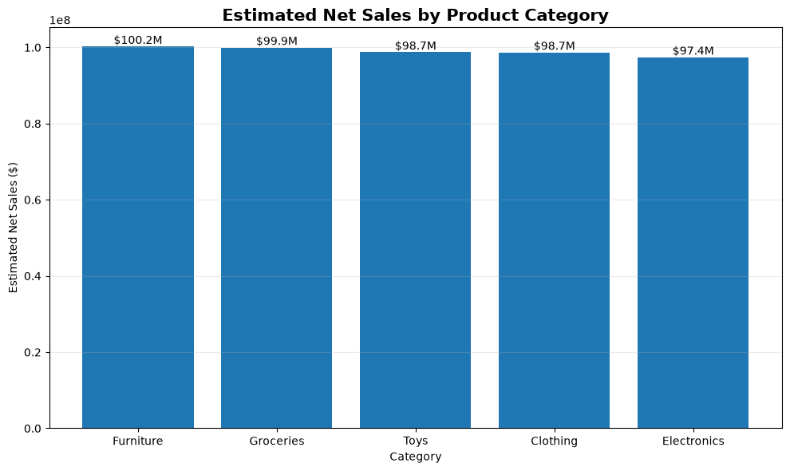
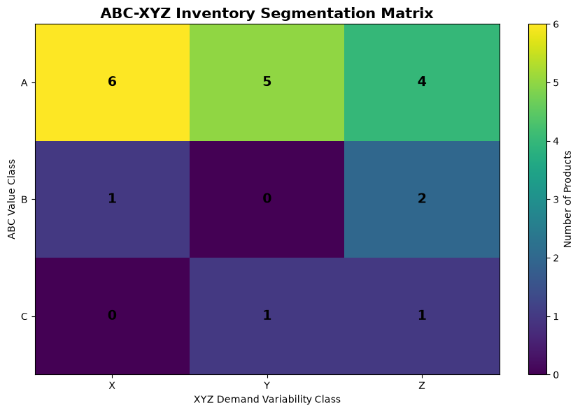
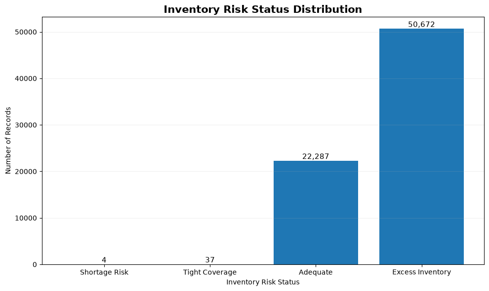
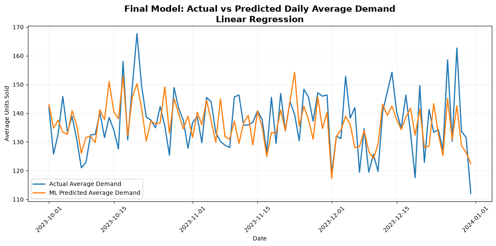

# Smart Retail Supply Chain Analytics

### Inventory Optimization, Demand Forecasting & Pricing Intelligence

**AICTE | IBM SkillsBuild Data Analytics with AI Internship Project | BharatCares**

---

## Project Overview

This project presents an end-to-end retail supply chain analytics and machine learning workflow for analyzing sales demand, inventory performance, product behavior, pricing, promotions, seasonality, and replenishment risk.

The project combines:

- Exploratory and business analytics
- ABC-XYZ inventory segmentation
- Historical inventory risk assessment
- Machine learning-based demand forecasting
- Forecast benchmarking
- Forecast-driven inventory decision support
- Reusable analytical outputs and trained model artifacts

The objective is not only to train a machine learning model, but also to demonstrate how retail data can be transformed into useful supply chain insights and how forecast quality can affect downstream inventory decisions.

> **Dataset Note:** The dataset used in this project is synthetic. Therefore, the findings demonstrate analytical methodology and decision-support techniques rather than the actual performance of a real retail organization.

---

## Project Objectives

- Analyze historical retail sales and demand patterns
- Evaluate inventory levels and stock availability
- Identify product, category, store, and regional performance patterns
- Analyze pricing, discounts, promotions, and competitor pricing
- Study seasonal and external factors associated with demand
- Perform ABC product classification
- Perform XYZ demand variability classification
- Build an ABC-XYZ inventory segmentation framework
- Identify shortage, tight-coverage, adequate, and excess inventory situations
- Build independent machine learning models for demand forecasting
- Compare regression models using chronological validation
- Analyze forecast errors and model limitations
- Compare the independently trained model with the dataset-provided forecast
- Evaluate how forecast quality influences inventory decision support
- Export reusable analytical summaries and model artifacts

---

## Dataset

**Dataset:** Retail Store Inventory Forecasting Dataset  
**Source:** Kaggle  
**Author:** Anirudh Singh Chauhan

**Dataset Link:**  
https://www.kaggle.com/datasets/anirudhchauhan/retail-store-inventory-forecasting-dataset

The original dataset contains **73,100 records and 15 columns** covering retail demand, inventory, pricing, promotions, weather, seasonality, stores, products, and regions.

### Main Features

| Feature            | Description                      |
| ------------------ | -------------------------------- |
| Date               | Date of observation              |
| Store ID           | Store identifier                 |
| Product ID         | Product identifier               |
| Category           | Product category                 |
| Region             | Store region                     |
| Inventory Level    | Available inventory              |
| Units Sold         | Actual units sold                |
| Units Ordered      | Replenishment quantity           |
| Demand Forecast    | Dataset-provided demand forecast |
| Price              | Product selling price            |
| Discount           | Discount percentage              |
| Weather Condition  | Weather category                 |
| Holiday/Promotion  | Promotion or holiday indicator   |
| Competitor Pricing | Competitor price                 |
| Seasonality        | Seasonal category                |

`Units Sold` is used as the target variable for the independently trained machine learning models.

---

## Data Preparation

The workflow includes:

- Dataset structure and schema validation
- Missing-value and duplicate checks
- Numerical validity checks
- Date validation
- Text standardization
- Business and time feature engineering
- Leakage-control analysis
- Chronological model splitting

The complete historical analytical period contains:

**73,000 records from 2022-01-01 through 2023-12-31**

An additional **100 records dated 2024-01-01** were incomplete for the modeling workflow and were excluded from chronological model evaluation.

### Leakage Control

Two important variables were deliberately excluded from the independent ML feature set:

- `Demand Forecast` — excluded because its generation methodology is undocumented.
- `Units Ordered` — excluded because replenishment quantities may contain information derived from previous demand expectations.

The dataset-provided `Demand Forecast` is evaluated separately as an **external benchmark**.

---

## Analytical Workflow

```text
Data Loading
    ↓
Data Quality Assessment
    ↓
Data Cleaning & Feature Engineering
    ↓
Exploratory & Business Analytics
    ↓
ABC-XYZ Inventory Segmentation
    ↓
Historical Inventory Risk Analysis
    ↓
Machine Learning Dataset Preparation
    ↓
Chronological Model Training
    ↓
Model Evaluation & Error Analysis
    ↓
External Forecast Benchmark
    ↓
Forecast-Based Inventory Decision Validation
    ↓
Exported Analytics & Model Artifacts
```

---

# Exploratory & Business Analytics

The analytical stage investigates demand patterns, product and category performance, stores and regions, inventory, pricing, promotions, competitor pricing, weather, and seasonality.

Machine learning is used as an additional forecasting and validation component rather than replacing the business analytics portion of the project.

---

## Demand Trend Analysis

Daily demand contains considerable short-term variation, while the 30-day moving average remains comparatively stable throughout the complete historical period.

<p align="center">
  
</p>

<p align="center">
  <em>Figure 1 — Daily Retail Demand Trend with 30-Day Moving Average</em>
</p>

Key demand statistics include:

| Metric                    |           Value |
| ------------------------- | --------------: |
| Average Daily Demand      | 13,646.49 units |
| Highest Daily Demand      |    17,239 units |
| Lowest Daily Demand       |    10,642 units |
| Highest Full-Demand Month |         2023-07 |
| Lowest Full-Demand Month  |         2023-02 |

The chart indicates substantial daily variation without an extreme long-term upward or downward demand trend.

---

## Product Category Performance

Estimated net sales are relatively balanced across the five product categories.

<p align="center">
  
</p>

<p align="center">
  <em>Figure 2 — Estimated Net Sales by Product Category</em>
</p>

Furniture records the highest estimated net sales at approximately **$100.2 million**, followed closely by Groceries. Electronics records the lowest at approximately **$97.4 million**.

The relatively narrow differences indicate that no single category overwhelmingly dominates the synthetic dataset.

---

# ABC-XYZ Inventory Segmentation

ABC-XYZ analysis combines product value contribution with demand variability.

### ABC Classification

Products are classified using their contribution to **Estimated Net Sales**.

| ABC Class | Products | Product Share |
| --------- | -------: | ------------: |
| A         |       15 |           75% |
| B         |        3 |           15% |
| C         |        2 |           10% |

### XYZ Classification

XYZ classification represents relative monthly demand variability using coefficient-of-variation-based groups.

### Combined ABC-XYZ Segments

| Segment | Products |
| ------- | -------: |
| AX      |        6 |
| AY      |        5 |
| AZ      |        4 |
| BX      |        1 |
| BY      |        0 |
| BZ      |        2 |
| CX      |        0 |
| CY      |        1 |
| CZ      |        1 |

<p align="center">
  
</p>

<p align="center">
  <em>Figure 3 — ABC-XYZ Inventory Segmentation Matrix</em>
</p>

The matrix provides a structured product-management framework.

For example:

- **AX** products combine high relative value with more stable demand.
- **AZ** products combine high relative value with greater demand variability.
- Lower-value segments can generally receive different levels of inventory attention.

These strategies are analytical decision-support guidelines rather than optimized reorder policies.

---

# Historical Inventory Risk Analysis

Historical inventory conditions were evaluated using inventory position, the dataset-provided forecast, and forecast-error uncertainty.

### Historical Risk Distribution

| Inventory Risk   | Records |  Share |
| ---------------- | ------: | -----: |
| Shortage Risk    |       4 |  0.01% |
| Tight Coverage   |      37 |  0.05% |
| Adequate         |  22,287 | 30.53% |
| Excess Inventory |  50,672 | 69.41% |

<p align="center">
  
</p>

<p align="center">
  <em>Figure 4 — Historical Inventory Risk Status Distribution</em>
</p>

The analysis indicates that **excess inventory is the dominant historical inventory condition**, representing approximately **69.41%** of complete historical inventory-risk records.

Historical shortage-risk cases are rare in comparison.

> These results are historical decision-support estimates. They are not optimized purchase orders because supplier lead time, ordering cost, holding cost, minimum order quantity, and real business service-level targets are not available in the dataset.

---

# Machine Learning Approach

Three regression algorithms were evaluated:

1. **Linear Regression**
2. **Random Forest Regressor**
3. **HistGradientBoosting Regressor**

### Target Variable

```text
Units Sold
```

### Model Inputs

The ML dataset contains:

- **21 input features before preprocessing**
- **15 numerical features**
- **6 categorical features**
- **57 processed features after preprocessing and encoding**

---

## Chronological Train-Test Split

A chronological split was used instead of a random split to better represent a forecasting scenario.

| Dataset  | Period                   | Records |
| -------- | ------------------------ | ------: |
| Training | 2022-01-01 to 2023-09-30 |  63,800 |
| Testing  | 2023-10-01 to 2023-12-31 |   9,200 |

This prevents future observations from being randomly mixed into the training data.

---

## Model Performance

| Model                          |   Test MAE |  Test RMSE |    Test R² |
| ------------------------------ | ---------: | ---------: | ---------: |
| **Linear Regression**          | **68.946** | **87.923** | **0.3390** |
| HistGradientBoosting Regressor |     68.966 |     88.021 |     0.3376 |
| Random Forest Regressor        |     70.645 |     89.020 |     0.3224 |

### Selected Model

**Linear Regression** was selected as the final independently trained model.

It achieved the lowest chronological test MAE and RMSE while showing a very small train-test performance gap.

Random Forest achieved stronger training performance but weaker test performance, indicating greater overfitting.

---

## Actual vs Predicted Demand

<p align="center">
  
</p>

<p align="center">
  <em>Figure 5 — Actual vs Predicted Daily Average Demand for the Selected Linear Regression Model</em>
</p>

The figure demonstrates that the baseline model captures some broad variation but tends to smooth demand and does not reproduce high-demand peaks effectively.

---

# External Forecast Benchmark

The source dataset already contains a `Demand Forecast` column.

It was **not used as an ML training feature**.

Instead, it is evaluated as an external benchmark on the same chronological test period.

| Forecast Source                  |    MAE |   RMSE |     R² |
| -------------------------------- | -----: | -----: | -----: |
| Selected Linear Regression       | 68.946 | 87.923 | 0.3390 |
| Dataset-Provided Demand Forecast |  8.347 | 10.035 | 0.9914 |

The supplied forecast performs substantially better numerically.

However, its generation methodology and information availability are undocumented. Therefore, it should **not be interpreted as a leakage-free, like-for-like competitor** to the independently trained project model.

---

# Model Error Analysis

An important limitation appears when demand is high.

For test observations where:

```text
Actual Units Sold >= 300
```

the final analysis produced:

| Metric                | Result |
| --------------------- | -----: |
| High-Demand Records   |    924 |
| Average Actual Demand | 362.58 |
| Average ML Forecast   | 212.78 |
| ML MAE                | 149.80 |
| ML Underforecast Rate |   100% |

The selected Linear Regression model therefore tends to regress toward the average and substantially underpredict high-demand observations.

The model should be considered a **baseline forecasting model rather than a production-ready demand forecasting system**.

---

# Forecast Impact on Inventory Decisions

Forecasting performance was also evaluated from an operational inventory perspective.

Both forecast sources were applied to the **same 9,200 test records using the same inventory position, safety-buffer logic, risk thresholds, and decision rules**.

### Test-Period Inventory Risk

| Risk Level       | Supplied Forecast | ML Forecast |
| ---------------- | ----------------: | ----------: |
| Shortage Risk    |                 0 |           0 |
| Tight Coverage   |               308 |           0 |
| Adequate         |             2,502 |           0 |
| Excess Inventory |             6,390 |       9,200 |

The independently trained ML model classified all 9,200 test observations as excess inventory under the comparison rules.

### Replenishment Impact

Neither forecast source produced a positive replenishment requirement during the October–December 2023 test period under the common decision rules.

This demonstrates an important supply-chain principle:

> **Forecast quality should be validated not only using statistical accuracy metrics, but also through the operational decisions produced by the forecast.**

Because the baseline ML model exhibits substantial high-demand underforecasting and unrealistic downstream inventory-risk behavior, the historical inventory analysis remains the primary source for inventory insights in this project.

---

# Feature Influence

Linear Regression coefficient analysis was used as a model-interpretation tool.

The strongest coefficient by absolute magnitude was associated with the engineered feature:

```text
Competitor_Price_Ratio
```

Approximate coefficient:

```text
-4.1695
```

This is a model association and should **not be interpreted as evidence of causality**.

---

# Why LSTM Was Not Used

LSTM was considered but deliberately excluded from the final modeling workflow.

The current project uses structured daily retail records without a dedicated lagged sequence architecture.

Using LSTM without first creating appropriate product-store sequences, lag features, rolling statistics, and forecasting windows would add complexity without providing a sound comparison.

A future version could develop a dedicated sequential forecasting pipeline before evaluating LSTM or other deep-learning methods.

---

# Project Architecture

The project is organized around six major analytical components:

1. Exploratory Data Analysis
2. ABC-XYZ Inventory Segmentation
3. Historical Inventory Risk Analysis
4. Independent Machine Learning Forecasting
5. External Forecast Benchmarking
6. Forecast-Based Inventory Decision Validation

---

# Repository Structure

```text
smart-retail-supply-chain/
│
├── assets/
│   ├── abc_xyz_matrix.png
│   ├── actual_vs_predicted.png
│   ├── demand_trend.png
│   ├── estimated_net_sales_by_category.png
│   └── inventory_risk_distribution.png
│
├── data/
│   └── retail_cleaned_data.csv
│
├── model/
│   ├── linear_regression_model.joblib
│   ├── model_metadata.json
│   ├── preprocessor.joblib
│   ├── processed_feature_names.csv
│   └── retail_demand_model_bundle.joblib
│
├── outputs/
│   ├── abc_executive_summary.csv
│   ├── abc_xyz_product_segmentation.csv
│   ├── abc_xyz_segment_summary.csv
│   ├── executive_kpis.csv
│   ├── export_manifest.csv
│   ├── final_project_architecture.csv
│   ├── final_project_findings.csv
│   ├── forecast_accuracy_comparison.csv
│   ├── forecast_inventory_risk_comparison.csv
│   ├── forecast_replenishment_comparison.csv
│   ├── historical_inventory_kpis.csv
│   ├── historical_inventory_risk_summary.csv
│   ├── linear_regression_feature_influence.csv
│   ├── priority_shortage_records.csv
│   └── product_inventory_risk_summary.csv
│
├── src/
│   └── test_model.py
│
├── .gitignore
├── README.md
├── requirements.txt
└── SayanGhorai_SmartRetailSupplyChain.ipynb
```

---

# Generated Analytical Outputs

The completed notebook exports reusable analytical assets covering:

- Executive KPIs
- ABC classification
- ABC-XYZ segmentation
- Historical inventory-risk analysis
- Product-level inventory risk
- Priority shortage cases
- Forecast accuracy comparison
- Forecast inventory-risk comparison
- Forecast replenishment comparison
- Linear Regression feature influence
- Final project findings
- Final project architecture
- Export manifest

Three larger row-level reproducible outputs are generated locally but intentionally excluded from GitHub through `.gitignore`:

```text
outputs/historical_inventory_risk.csv
outputs/forecast_decision_support_comparison.csv
outputs/ml_test_predictions_and_errors.csv
```

They can be regenerated by running the completed notebook.

---

# Saved Model Artifacts

The selected trained model and preprocessing pipeline are stored in the `model/` directory.

Primary model bundle:

```text
model/retail_demand_model_bundle.joblib
```

Additional artifacts include:

```text
model/linear_regression_model.joblib
model/preprocessor.joblib
model/processed_feature_names.csv
model/model_metadata.json
```

---

## Model Portability Validation

The repository includes:

```text
src/test_model.py
```

This script loads the cleaned dataset and saved model artifacts independently from the training notebook.

The final local validation reproduced the notebook results on **9,200 test records**:

```text
MAE  : 68.946
RMSE : 87.923
R²   : 0.3390
```

The portability test confirms that the saved model package works independently from the original training notebook.

---

# Technologies Used

- Python 3.12
- Pandas
- NumPy
- Matplotlib
- Scikit-learn
- Joblib
- Jinja2
- Jupyter Notebook
- Kaggle
- Visual Studio Code
- Git
- GitHub

---

# Installation

Clone the repository:

```bash
git clone https://github.com/SayanGhorai/smart-retail-supply-chain.git
cd smart-retail-supply-chain
```

Create a virtual environment:

```bash
python -m venv .venv
```

Activate the environment on Windows PowerShell:

```powershell
.venv\Scripts\Activate.ps1
```

Install the required packages:

```bash
pip install -r requirements.txt
```

---

# Running the Project

Open the notebook:

```text
SayanGhorai_SmartRetailSupplyChain.ipynb
```

Run the notebook cells sequentially to reproduce the complete analytical workflow.

To validate the exported machine learning model package independently:

```bash
python src/test_model.py
```

---

# Requirements

The reproducible Python environment is defined in `requirements.txt`:

```text
pandas==2.3.3
numpy==2.0.2
matplotlib==3.11.2
scikit-learn==1.6.1
joblib==1.5.3
Jinja2==3.1.6
```

---

# Key Conclusions

The project demonstrates that supply chain analytics benefits from combining descriptive analytics, product segmentation, demand forecasting, and operational validation.

Key conclusions include:

- ABC-XYZ segmentation provides a structured framework for prioritizing inventory attention.
- Historical analysis identified excess inventory as the dominant inventory condition in the synthetic dataset.
- Chronological validation provides a more realistic forecasting assessment than randomly mixing past and future observations.
- Linear Regression provided the strongest chronological test performance among the independently trained models evaluated.
- The selected baseline ML model has significant limitations when forecasting high-demand observations.
- The dataset-provided forecast performs substantially better statistically, but its generation methodology is undocumented.
- Statistical forecast accuracy and operational inventory consequences should both be evaluated.
- A model that performs acceptably on average may still generate unsuitable downstream decisions.

---

# Limitations

This project has several important limitations:

- The dataset is synthetic and does not represent a real retailer.
- The generation methodology of the supplied `Demand Forecast` is undocumented.
- Independent ML models do not use dedicated lagged product-store time-series sequences.
- Linear Regression substantially underpredicts high-demand observations.
- Model coefficients represent statistical associations rather than causal effects.
- Inventory decision rules are analytical approximations.
- Supplier lead times, holding costs, ordering costs, minimum order quantities, and real service-level requirements are unavailable.

---

# Future Improvements

Potential extensions include:

- Lag-based demand features
- Rolling demand statistics
- Product-store level forecasting models
- Time-series cross-validation
- XGBoost or LightGBM comparison
- Dedicated statistical time-series models
- LSTM or sequence models after proper sequence preparation
- Dynamic safety-stock calculation
- Supplier lead-time integration
- Service-level optimization
- Interactive Streamlit dashboard
- Automated inventory alerts
- Replenishment recommendation workflows

---

# Project Context

This project was developed as part of the **AICTE | IBM SkillsBuild Data Analytics with AI Internship Program — BharatCares**.

The repository documents the complete analytics, machine learning, validation, reproducibility, and decision-support workflow developed for the internship project.

---

# Author

**Sayan Ghorai**

AICTE | IBM SkillsBuild Data Analytics with AI Internship Project

---

# Disclaimer

This project is intended for educational and analytical demonstration purposes.

Because the source dataset is synthetic, the results should not be interpreted as actual commercial retail performance or used directly for real-world inventory decisions without further validation.
